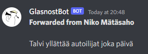
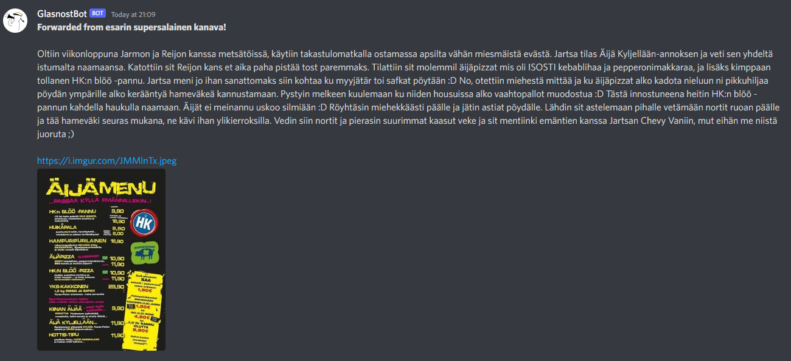

## GlasnostBot

A bot made for forwarding Oulun Tietoteekkarit ry Telegram announcements from OTiT glasnost to their Discord server.

All text from shorter than 2000 character messages, including forwards, is supported and copied from Telegram to 
Discord. Forwarded messages include name of the original message sender:

Forward from individual user. `prefer_username` option exists for users that have one 



Forward from a channel. Channel title is used by default.



The telegram library used in this bot is also made by me and has its own repository 
[telegram.py](https://github.com/Visperi/telegram.py).

## TODO
Non-exhaustive list of features still needed for stable support:

- Support messages over length of 2000 characters
- Support attachments in messages
    - In edited messages support attachment deletion(?)

## Running the bot

If you want to run this bot by yourself to whatever channels, you need `credentials.json` file in following format to 
the root of this repository:

```json
{
    "tokens": {
        "telegram": "TOKEN",
        "discord": "TOKEN"
    },
    "ids": {
        "telegram": -12345,
        "discord": [1, 2, 3]
    }
}
```

So before running the bot an application and token for both Telegram API and Discord API is needed.
There can currently be only one Telegram channel to listen and an arbitrary amount of listening Discord channels.
All IDs must be integers, and for Telegram they are always negative.

## Licence

MIT Licence

Full licence: [LICENCE](LICENCE)
