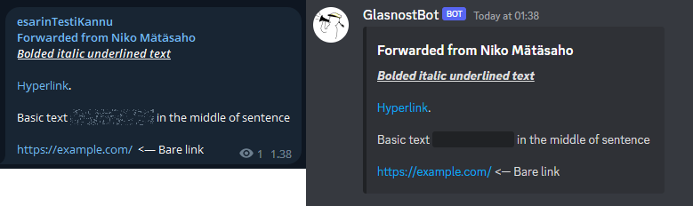
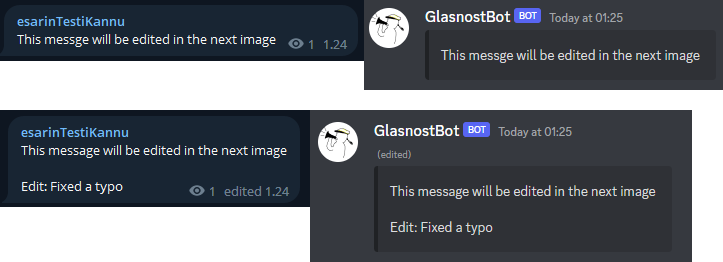
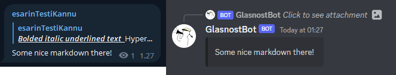
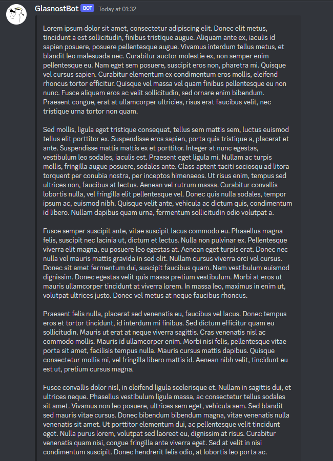

# GlasnostBot

**This bot requires Python 3.8 or higher**

A bot forwarding broadcast Telegram messages to Discord channels.

Simply put the bot listens to a Telegram channel and forwards messages from there to Discord channels in Discord 
compatible format. Message edits, replies and forwarded messages are fully supported. Only attachments and other 
non-text media are yet to be supported.

The telegram library used in this bot is also made by me and has its own repository 
[telegram.py](https://github.com/Visperi/telegram.py).

## Running the bot

The bot requires `config.toml` configuration file at the root level to work. `config_example.toml` can be used as a 
template. Install the requirements, configure the bot and start it by running `main.py`.

Once the bot is listening to a Telegram channel and has some Discord channels defined, it forwards all messages to 
Discord and serializes them into an internal database for future edits and replies. The messages are sent to Discord 
as soon as they are received, but discord.py internal ratelimiting may affect the speed if messages are sent rapidly.

## Configuration 

Most of the bot behaviour can be controlled through configuration in `config.toml`. Discord command `reload` can be 
used to reload the configuration at runtime. Bot restart is required only when changing API tokens.

#### Credentials

Remember to keep the tokens safe and never make them public. Anyone with the tokens has access to your bots.

Changing bot credentials require a complete restart for the bot.

|  variable  | value type | function           |
|:----------:|:----------:|--------------------|
| `telegram` |   String   | Telegram API token |
| `discord`  |   String   | Discord bot token  |

Click to open obtainment of API tokens

### Obtaining Discord API token

1. Go to your application settings in Discord developer portal
2. The application token is found from menu Bot -> Token. Client secret in OAuth2 section is incorrect one.
3. Reset the token and copy it into `config.toml`

### Obtaining Telegram API token

1. Open chat with the BotFather
2. Open the chat menu next to the text field
3. Select your bot and copy the token in spoilers and copy it into `config.toml`

#### Channel IDs

|  variable  |    value type    | function                                                                                                                                                         |
|:----------:|:----------------:|------------------------------------------------------------------------------------------------------------------------------------------------------------------|
| `telegram` |     Integer      | ID of a Telegram channel to listen to. Always starts with `-100`. Only one channel is currently supported.                                                       |
| `discord`  | List of integers | List of Discord channel IDs to forward the Telegram messages to. The Discord bot must have a permission to send messages and read old messages in these channels. |

#### Bot settings

Bot settings are used to control the bot presence and behaviour in Discord.

|      variable      |          value type           | function                                                                                                                                                                                                                                         |
|:------------------:|:-----------------------------:|--------------------------------------------------------------------------------------------------------------------------------------------------------------------------------------------------------------------------------------------------|
|  `command_prefix`  | String or iterable of strings | Determines accepted command prefix(es) in Discord. For iterable prefixes, see the note in discord.py [documentation](https://discordpy.readthedocs.io/en/stable/ext/commands/api.html?highlight=prefix#discord.ext.commands.Bot.command_prefix). |
| `activity_status`  |            String             | Used to set the bot status message in Discord. Leave as an empty string for no Discord status.                                                                                                                                                   |
| `dm_only_commands` |            Boolean            | Accept bot commands in Discord only through direct messages. Otherwise the commands can be executed in any Discord channel the bot can read.                                                                                                     |

#### Preferences

Preferences are used to control the Discord message forwarding behaviour.

|           variable            | value type | function                                                                                                                                                                                                       |
|:-----------------------------:|:----------:|----------------------------------------------------------------------------------------------------------------------------------------------------------------------------------------------------------------|
|  `prefer_telegram_usernames`  |  Boolean   | Prefer Telegram usernames over sender real name(s) in forwarded messages. Has no effect for forwarded channel posts.                                                                                           |
| `send_orphans_as_new_message` |  Boolean   | Send edits and replies not found in the bot database as completely new messages. Do note that e.g. short replies to old messages can look out of place if enabled, and some context should perhaps be given.   |
|  `message_cleanup_threshold`  |  Integer   | Inclusive age in days for for Discord messages to be deleted from the database in 6 hour intervals. References at least this old will be deleted, and cannot be directly replied or edited in Discord anymore. |
|    `update_age_threshold`     |  Integer   | Inclusive maximum age in seconds for hanging Telegram messages to forward to Discord. Messages can be left hanging e.g. due to lag spikes or bot downtimes.                                                    |
|        `database_path`        |   String   | Path to a sqlite3 database file used for storing the message references. If not found, a new file is created at bot startup.                                                                                   |

## Examples

Example of the fully supported nested text formatting:

Messages can of course also be edited:

...And replied to:

The maximum length for messages is 4096 characters like in free Telegram version:

## Licence

MIT Licence

Full licence: [LICENCE](LICENCE)
