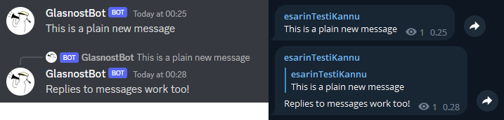
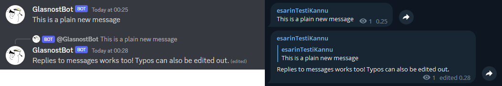
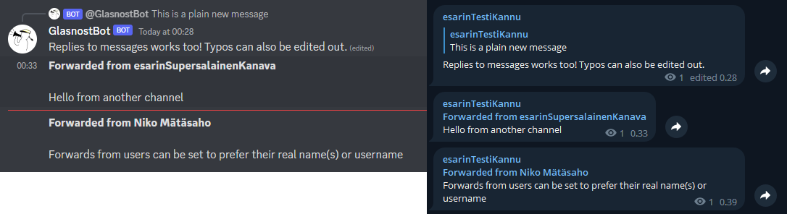

## GlasnostBot

A bot made for forwarding Oulun Tietoteekkarit ry Telegram announcements from OTiT glasnost to their Discord server.

All text from shorter than 2000 character messages, including forwards, edits and replies, are supported and forwarded 
from Telegram channel/group/chat to an arbitrary amount of Discord channels.

The capability of editing and replying to old Discord messages depends solely on if they are found in the sqlite3 
database this bot uses. A cleanup background loop is automatically run every 6 hours and removes over 30 days old 
references.

The telegram library used in this bot is also made by me and has its own repository 
[telegram.py](https://github.com/Visperi/telegram.py).

For showcase images of the bot in action see section [Images](#Images).

## Running the bot

Before running the bot an application and tokens for both Telegram API and Discord API are needed.

To run an instance of this bot by yourself, all that is required is to configure the `config.toml` file. 
A prefilled template can be found from `config_example.toml`. There can currently be only one Telegram channel to listen and an arbitrary amount of Discord channels where the 
messages are forwarded. All IDs must be integers, and for Telegram they are always negative starting with `-100`.

Preferences have the following settings:

1. `prefer_telegram_usernames`: Boolean value. In forwarded user messages prefer their username over their real name(s)
if possible. Has no effect for forwarded channel posts.
2. `message_cleanup_threshold`: Integer value. Inclusive age in days for Discord message references to be deleted from 
database on automatic cleanup loop. References at least this old will be deleted, and cannot be replied or edited in 
Discord anymore.
3. `update_age_threshold`: Integer value. Maximum age for hanging Telegram messages to forward to Discord, '
due to e.g. lag spikes or bot downtimes.
4. `database_path`: String value. Path to the sqlite3 database file used for storing message references.

## TODO
Non-exhaustive list of features still needed for stable support:

- Support messages over length of 2000 characters
- Support attachments in messages
    - In edited messages support attachment deletion(?)

## Images

Once the bot is listening to a Telegram channel and has some Discord channels defined, it forwards all messages to 
Discord and serializes them into a sqlite3 database for possible edits and replies.

Replied messages are also replied in Discord if message references are fround from the database.

Same goes for edited Telegram messages. Do note that edits into forwarded Telegram messages do not show in Telegram.

Forwarded messages include the name of the original message sender. For channels this means the channel title. 
For users this means their real name or username, depending on if `prefer_username` option is used.

## Licence

MIT Licence

Full licence: [LICENCE](LICENCE)
